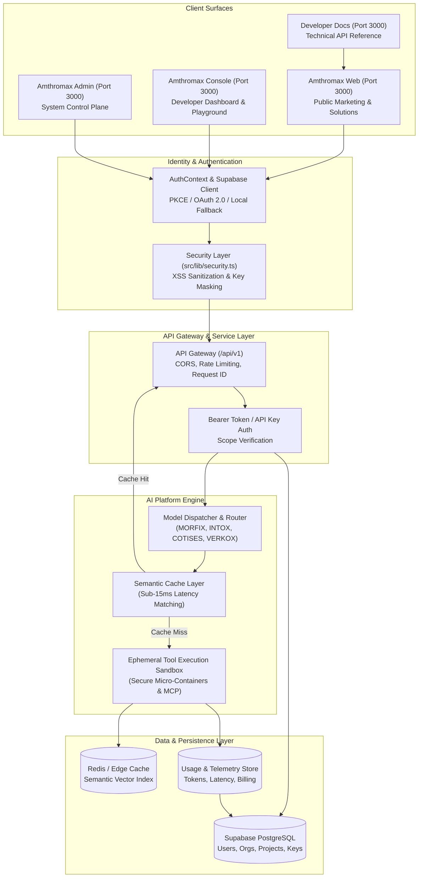

# AMTHROMAX PLATFORM ARCHITECTURE & SYSTEM DESIGN

## 1. System Architecture Overview



---

## 2. Platform Layers & Subsystems

### Layer 1: Universal Web Interfaces
- **Amthromax Web**: Serves as the primary public-facing surface (`/about`, `/products`, `/solutions`, `/pricing`). Built using React 19, Tailwind CSS, and optimized with complete SEO JSON-LD graphs (`Organization`, `WebSite`, `WebPage`, `BreadcrumbList`).
- **Amthromax Console**: Provides developers and enterprise users with interactive project management, API key rotation, model telemetry, and the Orchestrator Performance Playground (`/platform`).
- **Amthromax Admin**: Internal management interface (`/overview`, `/profile`) displaying global inference metrics, active model status, and uptime availability SLAs.
- **Developer Docs**: Comprehensive API reference manual (`/docs/getting-started`, `/docs/authentication`, `/docs/api`, `/docs/sdks`, `/docs/guides`, `/docs/changelog`) with type-safe code snippets and integration examples.

### Layer 2: Universal Identity & RBAC
- **User -> Organization -> Membership -> Role -> Project -> Environment**
- Roles defined across the ecosystem:
  - **Owner**: Complete administrative, financial, and workspace destruction privileges.
  - **Admin**: User management, project configuration, and API key provisioning.
  - **Developer**: Model execution, tool deployment, and API endpoint integration.
  - **Viewer**: Read-only access to usage dashboards and system status logs.
  - **Billing**: Access restricted to invoices, payment methods, and usage quota top-ups.

### Layer 3: API Gateway & Security Perimeter (`/api/v1`)
- **Authentication**: Dual support for PKCE OAuth bearer tokens (`auth.users`) and hashed API keys (`amx_live_...`).
- **Input Sanitization**: Client-side and gateway enforcement via `src/lib/security.ts`:
  - `sanitizeInput()`: XSS prevention.
  - `maskApiKey()`: Secret key UI masking (`amx_secr••••••••71b2`).
  - `containsMaliciousPayload()`: Pre-flight detection of SQL injection, script injection, and command execution vectors.
- **Rate Limiting & CORS**: Strict origin checks and sliding-window rate limiters.

### Layer 4: AI Platform & Model Routing Engine
- **Model Router**: Routes inference payloads dynamically based on token complexity, cost, and SLA:
  - `MORFIX 0.1` (1.4ms latency, 450 t/s) — Autonomous Agent Engine
  - `INTOX 0.2` (0.8ms latency, 1,200 t/s) — Low-Overhead Inference
  - `COTISES 0.5 MAX` (12.5ms latency, 180 t/s) — Deep Reasoning
  - `VERKOX 0.4 INSTANT` (0.3ms latency, 2,400 t/s) — Ephemeral Sandbox Execution
- **Semantic Caching**: Vector similarity matching (>0.94 cosine similarity) delivering cached reasoning outputs in under 15ms.
- **MCP (Model Context Protocol)**: EPhemeral, read-only sandboxes for executing database queries, bash tasks, and API integrations securely.

---

## 3. Observability & Telemetry Architecture
- **Request ID Tracking**: Every API request generates a UUID v4 `request_id` passed in `X-Request-Id` headers.
- **Standardized Usage Model**:
  ```json
  {
    "organization_id": "org_9f823a71b2",
    "project_id": "proj_prod_01",
    "user_id": "usr_uuid_1234",
    "request_id": "req_88f9a0c1",
    "provider": "Amthromax Core",
    "model": "MORFIX 0.1",
    "input_tokens": 1240,
    "output_tokens": 380,
    "latency_ms": 14,
    "cost_usd": 0.000324,
    "status": 200
  }
  ```
