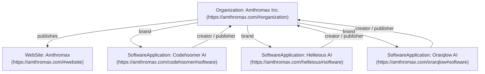

# Amthromax Product Entity SEO & Knowledge Graph Discoverability Implementation

## Overview
This document summarizes the entity SEO, Schema.org JSON-LD structured data, entity relationships, and Google discoverability implementation completed for **Amthromax** and its flagship product suite: **Codehoomer AI**, **Helleious AI**, and **Orarqlow AI**.

---

## Key Achievements

### 1. Canonical Product Page Entities & Schemas
- **Codehoomer AI (`https://amthromax.com/codehoomer`)**:
  - `SoftwareApplication` JSON-LD schema injected with `@id: "https://amthromax.com/codehoomer#software"`.
  - Linked to Amthromax via explicit `creator` and `publisher` properties pointing to `@id: "https://amthromax.com/#organization"`.
  - Canonical Title: `Codehoomer AI — AI Software Engineering Partner | Amthromax`.
  - Explicit hero copy: *"Codehoomer AI is an autonomous AI software developer developed by Amthromax."*

- **Helleious AI (`https://amthromax.com/helleious`)**:
  - `SoftwareApplication` JSON-LD schema injected with `@id: "https://amthromax.com/helleious#software"`.
  - Linked to Amthromax via explicit `creator` and `publisher` properties pointing to `@id: "https://amthromax.com/#organization"`.
  - Canonical Title: `Helleious AI — Enterprise Multi-Agent Operating System | Amthromax`.
  - Explicit hero copy: *"Helleious AI is an enterprise multi-agent operating system developed by Amthromax."*

- **Orarqlow AI (`https://amthromax.com/orarqlow`)**:
  - `SoftwareApplication` JSON-LD schema injected with `@id: "https://amthromax.com/orarqlow#software"`.
  - Linked to Amthromax via explicit `creator` and `publisher` properties pointing to `@id: "https://amthromax.com/#organization"`.
  - Canonical Title: `Orarqlow AI — Autonomous Agent Swarm Orchestration Engine | Amthromax`.
  - Explicit hero copy: *"Orarqlow AI is an autonomous agent swarm orchestration engine developed by Amthromax."*

---

### 2. Enterprise Organization Schema Update (`src/config/company.ts` & `src/components/layout/SEO.tsx`)
- Centralized `COMPANY_CONFIG.products` updated to include all three flagship products.
- Organization JSON-LD graph node updated with a `brand` property referencing all three products:
  ```json
  "brand": [
    { "@id": "https://amthromax.com/codehoomer#software" },
    { "@id": "https://amthromax.com/helleious#software" },
    { "@id": "https://amthromax.com/orarqlow#software" }
  ]
  ```

---

### 3. Entity Normalization Across Pages
- **Products Catalog Page (`/products`)**:
  - Updated to showcase **Codehoomer AI**, **Helleious AI**, and **Orarqlow AI** prominently at the top of the products grid with canonical links, verified descriptions, and clean icons.
- **About Page (`/about`)**:
  - Updated with an explicit entity relationship statement: *"Amthromax develops AI and software products including Codehoomer AI, Helleious AI, and Orarqlow AI, alongside modular enterprise infrastructure."*
  - Included interactive links and distinct verified descriptions for each product entity.

---

### 4. Indexation & Sitemap Automation
- Updated `scripts/generate-sitemap.cjs` to include canonical product routes (`/codehoomer`, `/helleious`, `/orarqlow`) with `0.9` priority and `weekly` change frequency.
- Executed `npm run build` to verify type-safety, Vite bundling, and sitemap generation (`public/sitemap.xml`).

---

## Structured Data Graph Summary



---

## Verification & Deployment Steps
1. **Google Rich Results Test**: Test URLs `https://amthromax.com/codehoomer`, `https://amthromax.com/helleious`, and `https://amthromax.com/orarqlow` at [Rich Results Test](https://search.google.com/test/rich-results).
2. **Schema Validator**: Validate complete entity graph at [Schema.org Validator](https://validator.schema.org/).
3. **Google Search Console**: Submit `sitemap.xml` in GSC and request indexing for product canonical routes.
