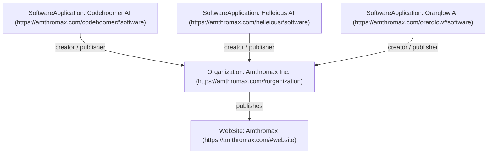

# Amthromax Entity SEO Strategy & Architecture

## Overview
This document outlines the entity search engine optimization (Entity SEO), Knowledge Graph signal alignment, and corporate identity structure implemented for **Amthromax** and its flagship products (including **Codehoomer AI**).

---

## Brand Entity Definitions

- **Official Name**: Amthromax
- **Legal Entity**: Amthromax Inc.
- **Industry Category**: AI Software & Enterprise Systems Company
- **Canonical Website**: `https://amthromax.com`
- **Official Contact**: `contact@amthromax.com`
- **Social Profiles**:
  - LinkedIn: `https://linkedin.com/company/amthromax`
  - GitHub: `https://github.com/amthromax`
  - X (Twitter): `https://x.com/amthromax`

---

## Entity Relationships

---

## Core Signals & Best Practices

1. **Naming Consistency**: Standardized spelling as `Amthromax` across code, metadata, schemas, and public copy.
2. **Canonical Domain Enforcement**: All internal routes enforce `https://amthromax.com` with clean trailing slashes or pathing.
3. **Structured Data Cross-Linking**: Every JSON-LD graph node links to `@id: "https://amthromax.com/#organization"` and `@id: "https://amthromax.com/#website"`.
4. **LLM & AI Crawler Support**: `robots.txt` explicitly grants access to major AI crawlers (GPTBot, ClaudeBot, Google-Extended, PerplexityBot, Applebot) to maximize discoverability in modern search and generative engine optimization (GEO).
